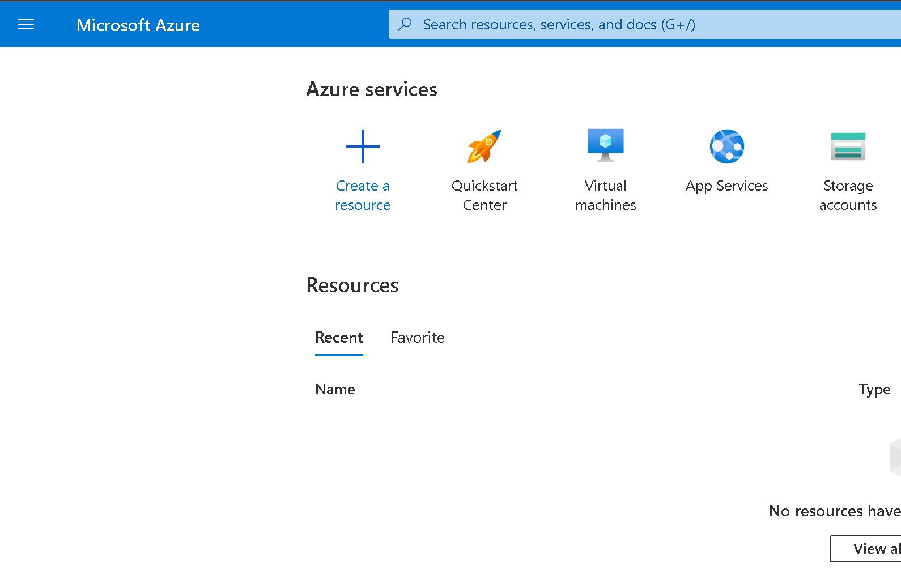
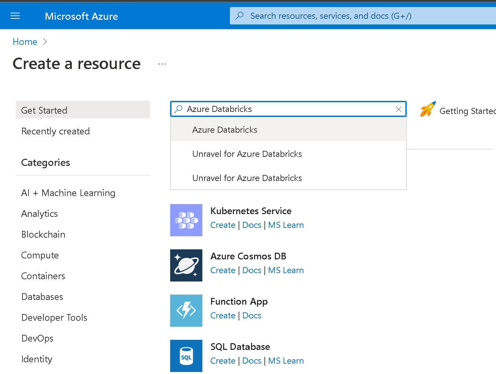
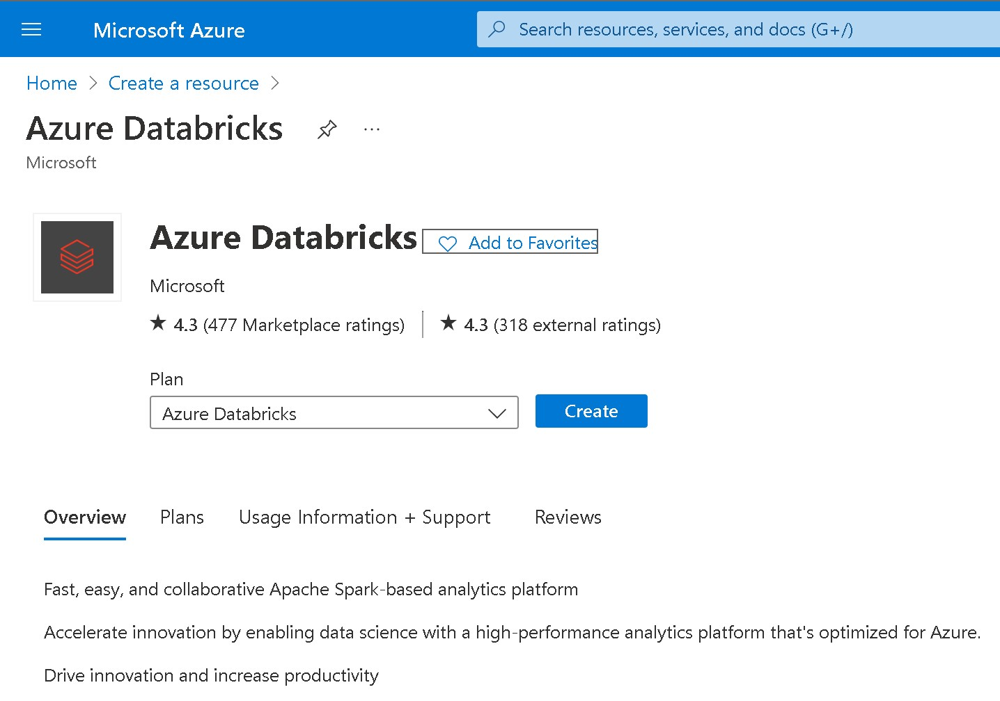
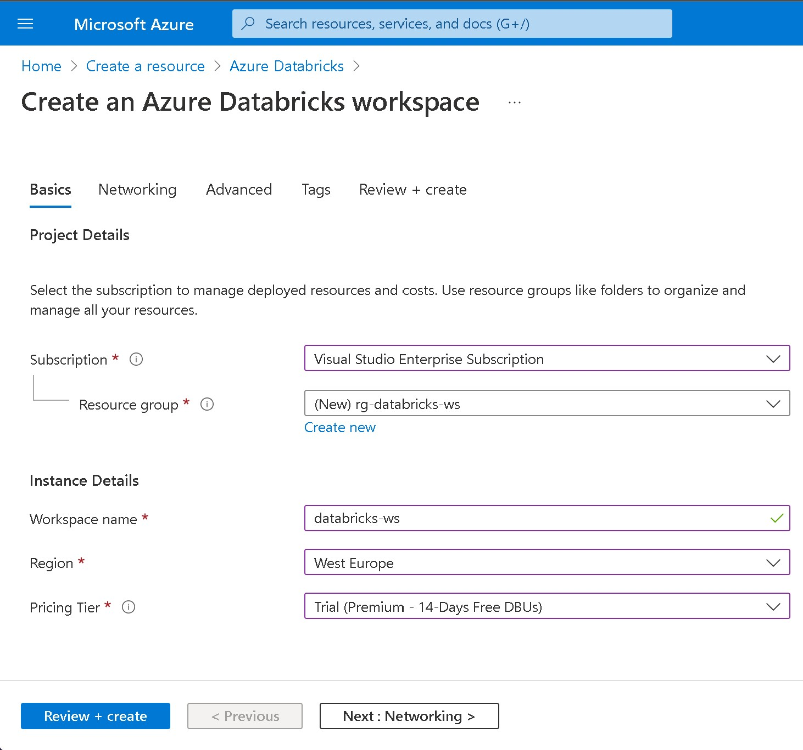
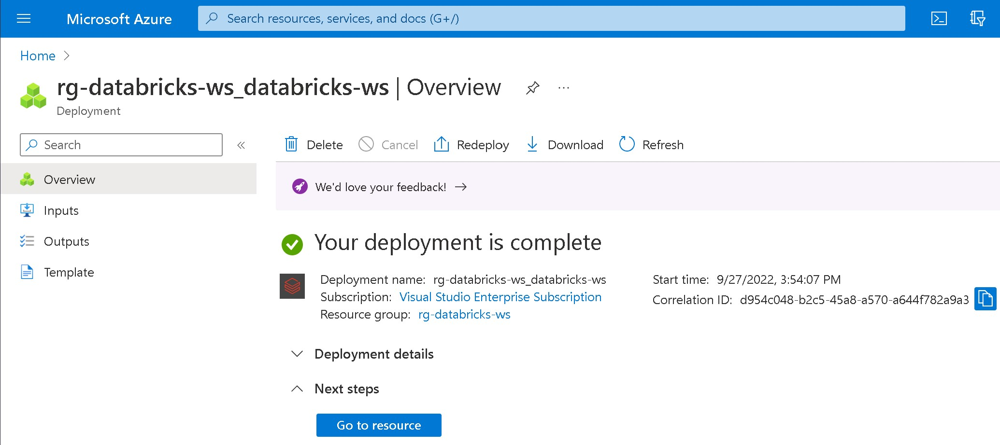
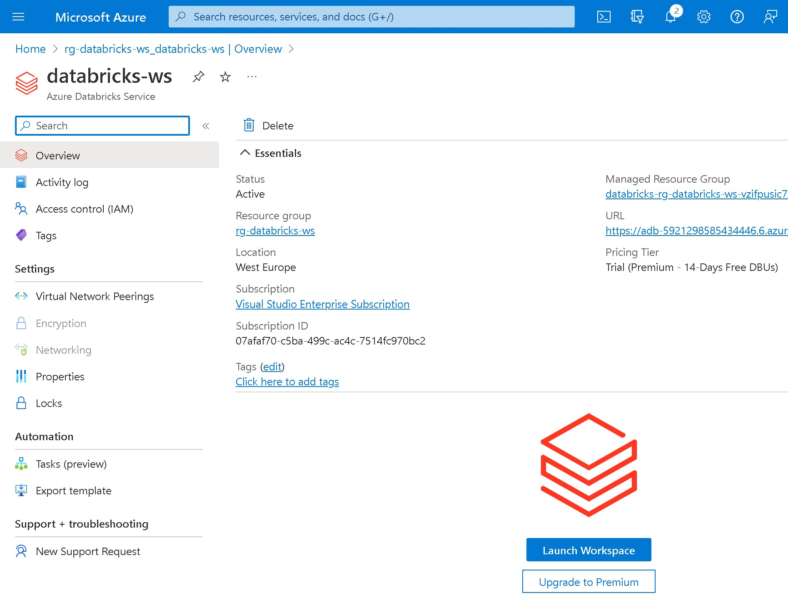
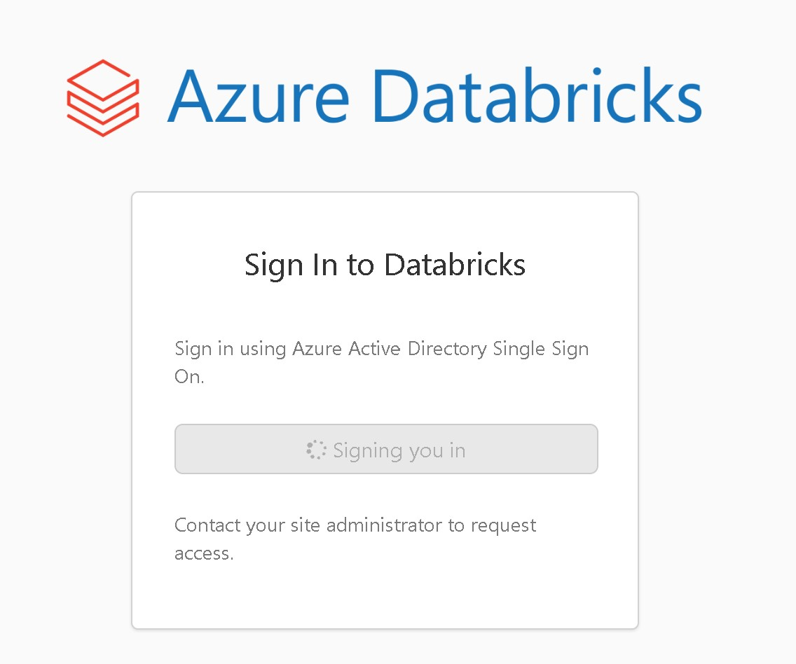
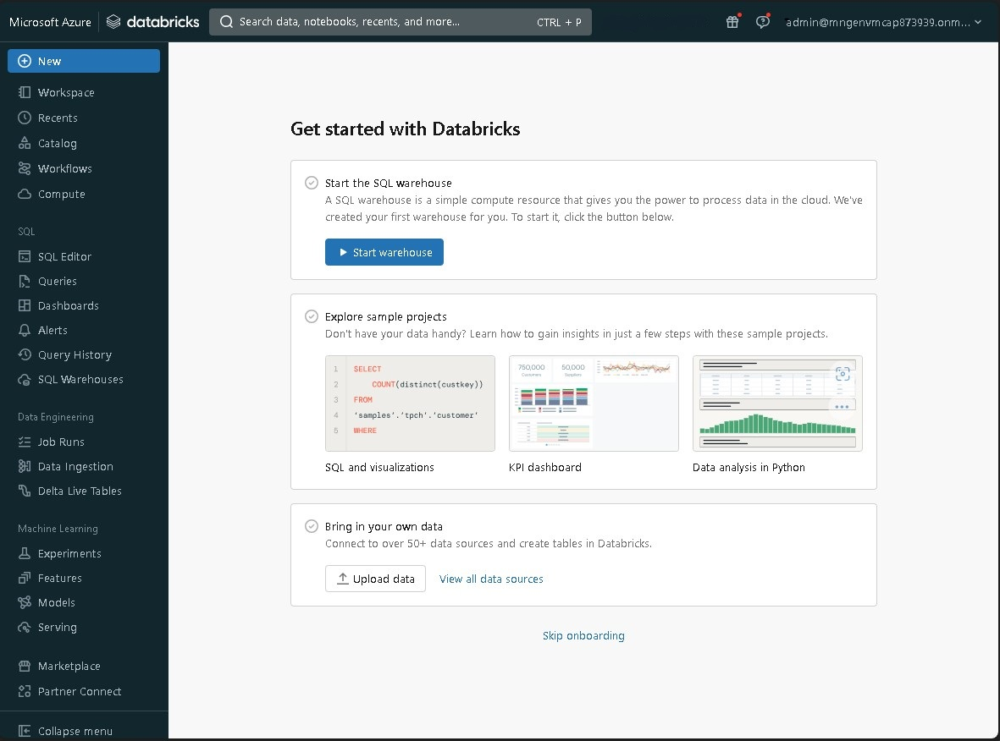

# Lab 01: Creating and configuring an Azure Databricks Workspace

## Goal 
During this lab you will learn how to provision an **Azure Databricks Workspace** through the Azure Portal

## Tasks

### Task 1: Creating the Databricks Workspace

1 - Log in to the Azure Portal: [https://portal.azure.com](https://portal.azure.com)

2 - When in the portal click on **Create a resource**

3 - Search for *Azure Databricks* in the search form and press enter

4 - In the Azure Databricks resouce page description click on *Create*

5 - Under Azure Databrick service provide the values to create a Databricks workspace

6 - Provide the following values:

| Property       | Description                                                                                                                                     | Example                             |
| -------------- | ----------------------------------------------------------------------------------------------------------------------------------------------- | ----------------------------------- |
| Subscription   | From the drop-down, select your Azure subscription.                                                                                             | Azure Sponsorship Pass              |
| Resource Group | Create a new resource group. You can use any name you want. A resource group is a container that holds related resources for an Azure solution. | rg-workshop                         |
| Workspace name | Provide a name for your Databricks workspace. You can use any name you want                                                                     | ws_databricks                       |
| Region         | Select your preferred region                                                                                                                    | West Europe                         |
| Pricing Tier   | Choose between Premium or Trial. Trial is a premium tier for a period of 14 days.                                                               | Trial (Premium - 14-Days Free DBUs) |
|Managed Resource Group| Leave empty| Empty|

7 - Click on *Review + Create*

This will start the creation of your workspace. The deployment can take few minutes.

8 - When the deployment process finish click on **Go to resource**

### Task 2: Launch the Databricks Workspace

9 - When in the Azure Databricks Workspace resource page click on **Launch Workspace**

You’ll be signed in to the databricks portal automatically.

Congratulations you're in your databricks workspace

This Lab has been completed!
