# Lab 03: Creating and executing a notebook

## Goal 
During this lab you will learn how to create a notebook in a Azure Databricks Workspace and execute some sample code

## Tasks

### Task 1: Create Notebook

1 - Into the Azure Databrick portal from the lef-sided menu select  **Create** + **Notebook**

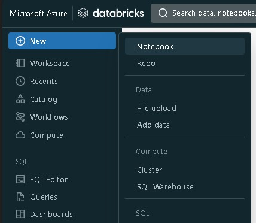

A new notebook will be automatically created with a default name and Python as default langauge

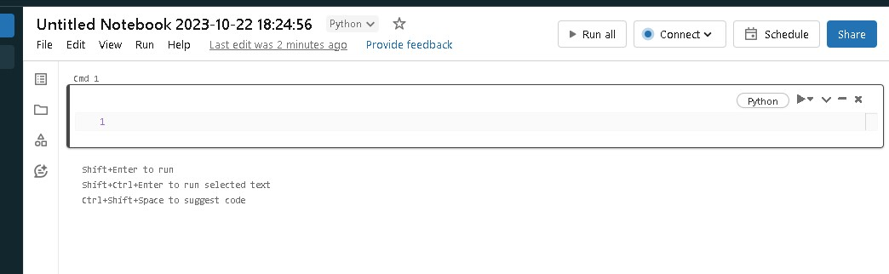

From the top menu we can change the name of the notebook and the language. 

2 - Change the name to *MyFirstNotebook*.

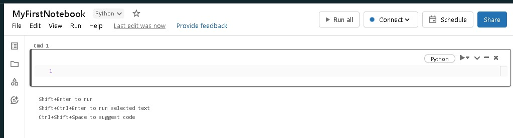

To run code in the notebook we need to connect it to a cluster.

3 - From the top menu on the right click on *Connect* and select the cluster you have created in the previous lab

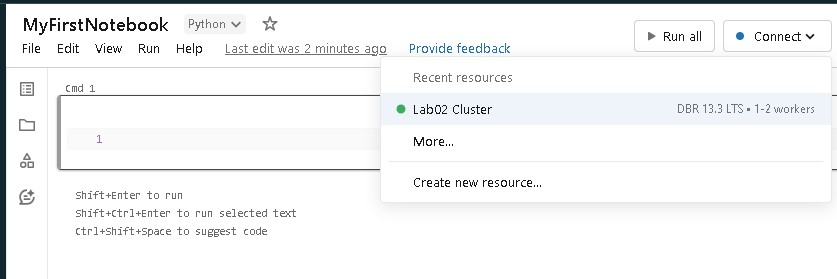

### Task 2: Write some code in your noebook

1 - In the first block write the following python command to print the string "Hello World":

```python
print("Hello World")
```

and click on **Shift + Run**

2 - In the following block we use the magic word %sql at the beginning of the block to run a Spark SQL command and show the available databases in our workspace

```sql
%sql
SHOW DATABASES
```

The output of this command should only show the dafault database.

3 - In the next block  write a command to show the list of the available tables in the current database (*default*)

```sql
%sql
SHOW TABLES
```

and click on **Shift + Run**

The query should return 0 results

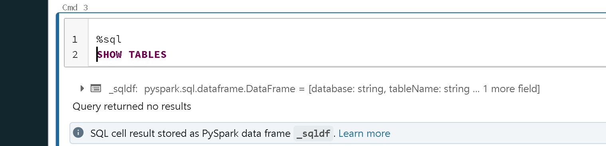

4 - In the next block write the following pyspark command to read a CSV file that is one of the databricks example datasets already available in the workspace

```python
df = spark.read.format('csv').option('header',True).option('inferSchema',True).load('dbfs:/databricks-datasets/bikeSharing/data-001/day.csv')
```

and click on **Shift + Run**

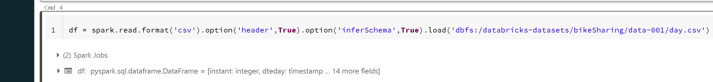

5 - In the next block write the following command to show the content of the dataset

```python
display(df)
```

and click on **Shift + Run**

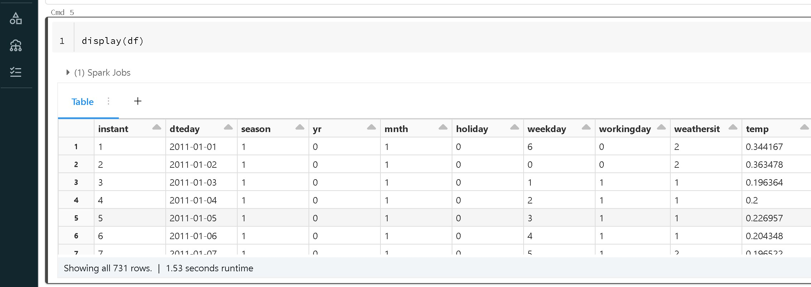

6 - In the next block write the following command to save the content of this Spark Dataframe as a table named **bikesharing** on the **default** database

```python
df.write.mode('overwrite').saveAsTable('default.bikesharing')
```
and click on **Shift + Run**

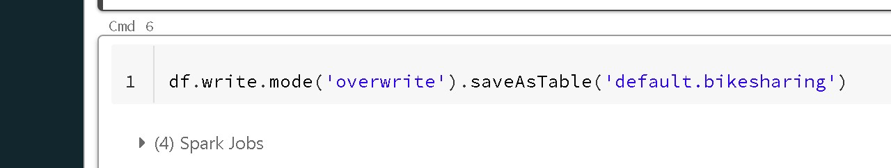

7 - To confirm that the table has been created write in the next block a command to show the list of the available tables in the current database (*default*)

```sql
%sql
SHOW TABLES
```

and click on **Shift + Run**

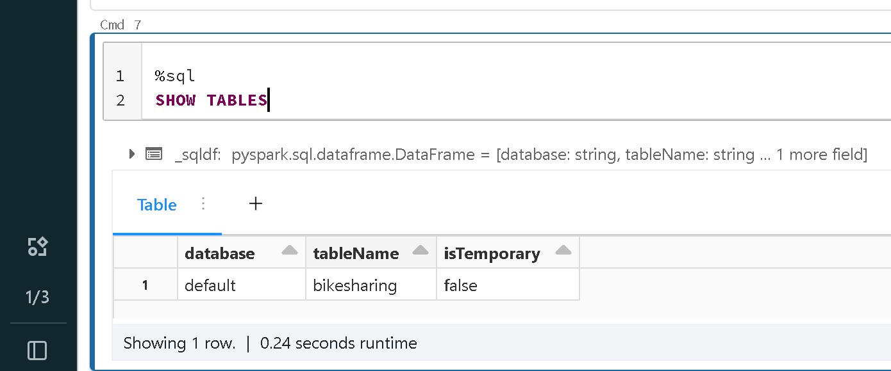

This time we should see the **bikesharing** table in the list

8 - In the next block we write a query to show the content of the table

```sql
%sql
SELECT * FROM bikesharing LIMIT 5
```

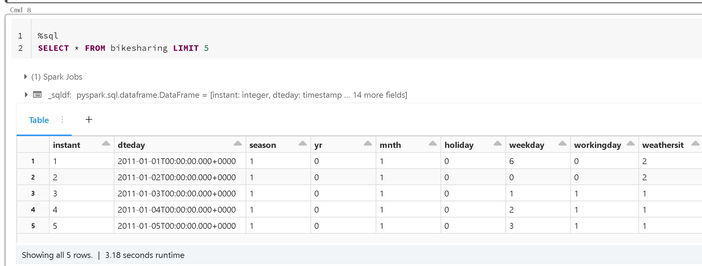

9 - As last step, in the same block we execute two sql statements, one for deleting the newly created table and the second one to show again the list of the tables

```sql
%sql
DROP TABLE IF EXISTS bikesharing;
SHOW TABLES;
```

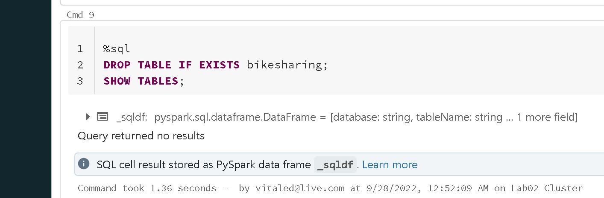

The output of this execution should be an empty list

### Task 3: Export your notebook

1 - To export the file in a ipynb format we click on **File** -> **Export** **IPython Notebook**

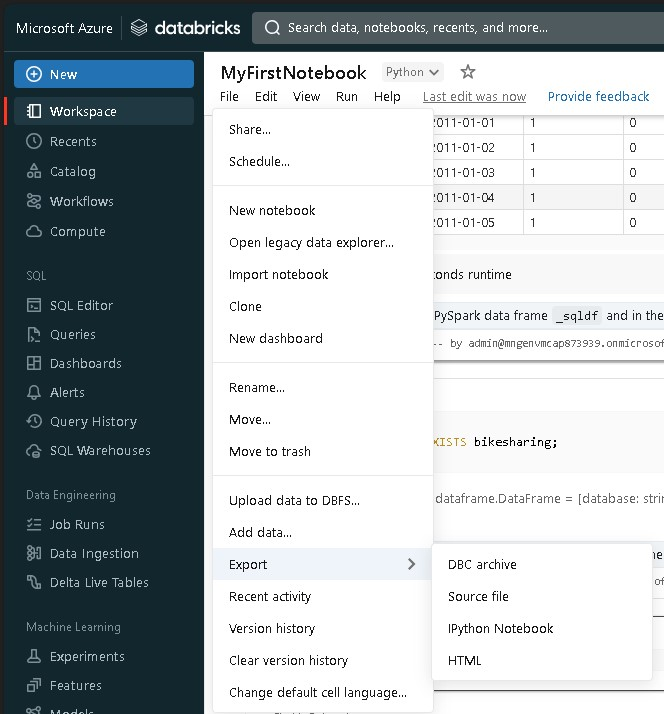

A file named MyFirstNotebook.ipynb should be downloaded on your local machine

This Lab has been completed!
