# Lab 04: Create and schedule a Job

## Goal
During this lab you will learn how to create and schedule a Job in a Azure Databricks 

## Tasks

### Task 1: Import notebook to schedule

1 - Click on **Workspace**, click on the three dots close to your name and from the dropdown menu click on **Import**

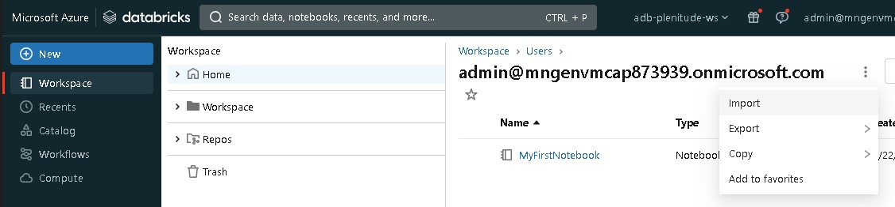

2 - Click on browse, select the file [UpdateFakeTable.ipynb](./UpdateFakeTable.ipynb) and click on import

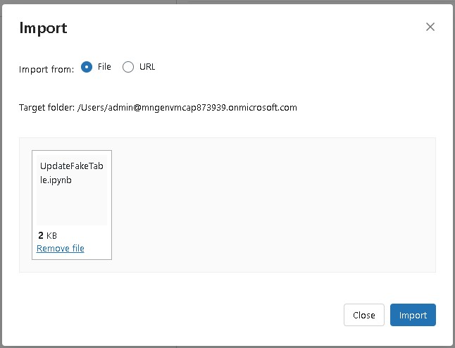

3 - In the notebook page click on **Run** and then **Run all**

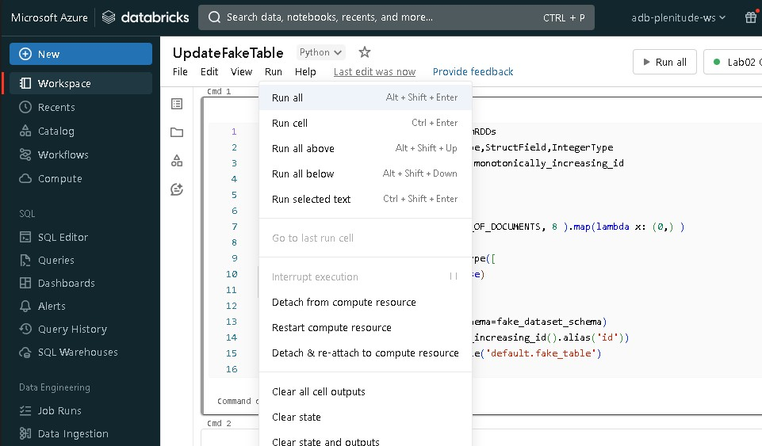

This first execution will create the table *default.fake_table* and insert 1000 entries
you can check this by looking at the result of the count statement

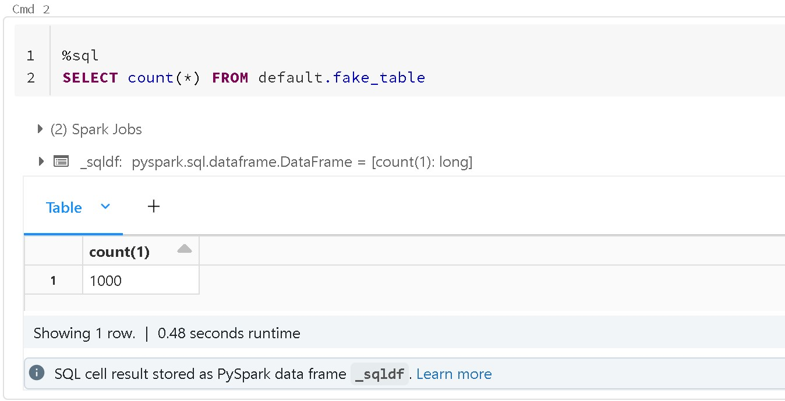

### Task 2: Create and Schedule a Job

1 - Into the Azure Databrick portal from the lef-sided menu select  **Create** + **Job** 

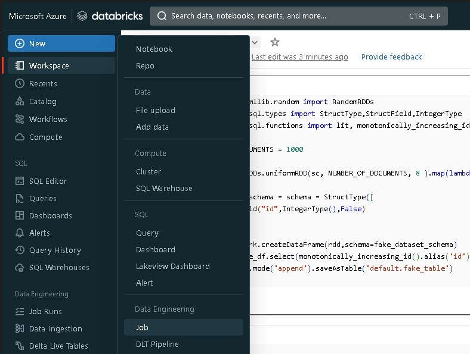

In the form provide the following details:

| property  | value                                  |
| --------- | -------------------------------------- |
| Job Name  | *FirstJob*                             |
| Task name | *UpdateFakeTable*                      |
| Type      | *Notebook*                             |
| Source    | *Workspace*                            |
| Path      | *path to the UpdateFakeTable notebook* |
| Cluster   | *select cluster created in the Lab 02  |

then click on **Create**

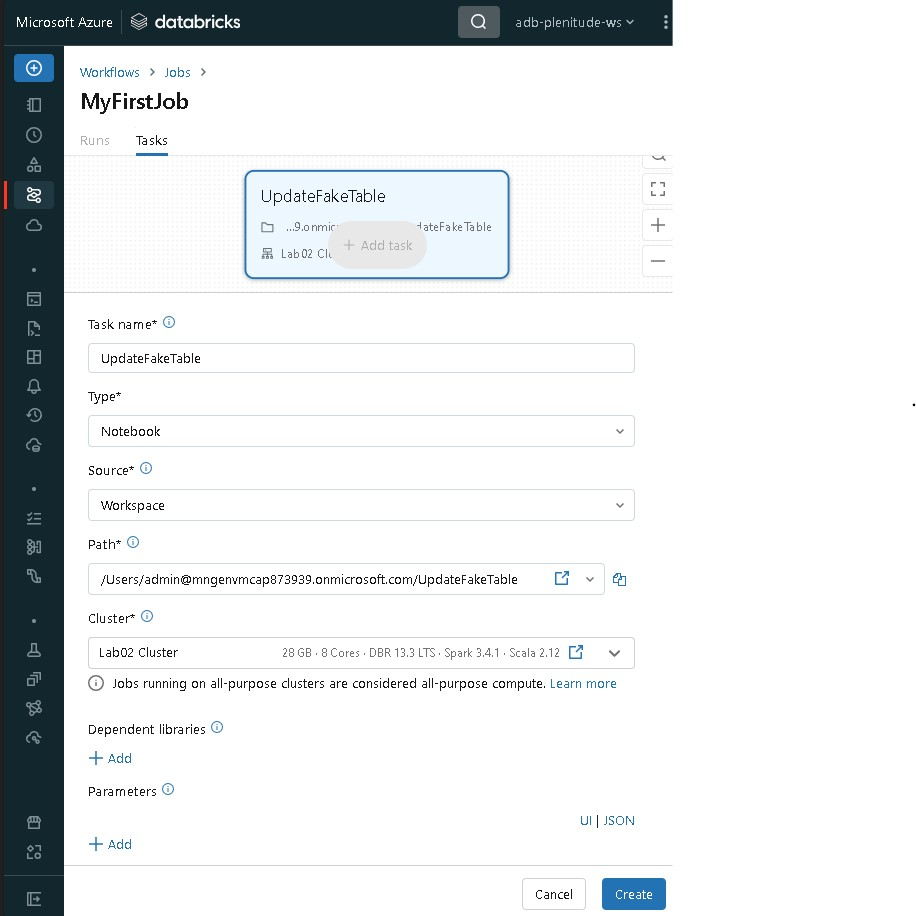

2 - In the Job details click on **Edit Schedule**

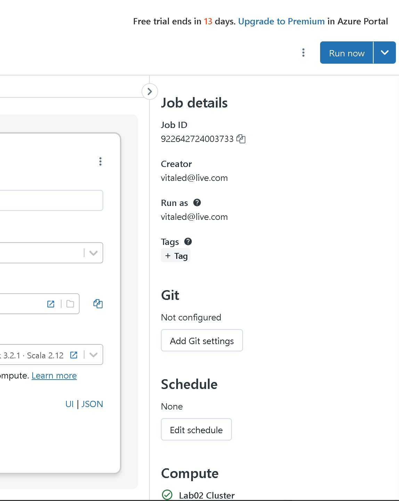

3 - Select **Scheduled** as Trigger type and **Every 1** and **minute** as other settings

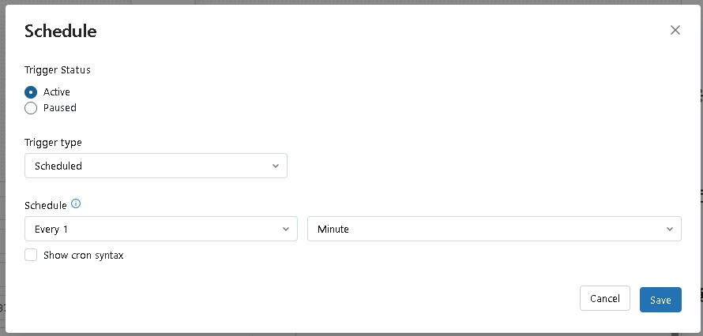

### Task 3: Check job results

4 - On the left-sided menu click on  **Job Runs** after one minute you should see the succeded execution

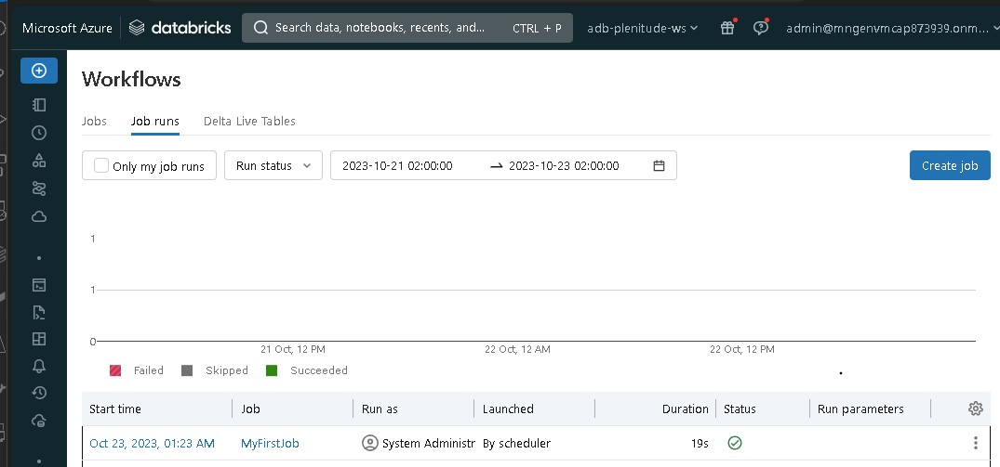

5 - Click on the date under the *Start time* column

You will see the result of the notebook execution the count now should be **2000**

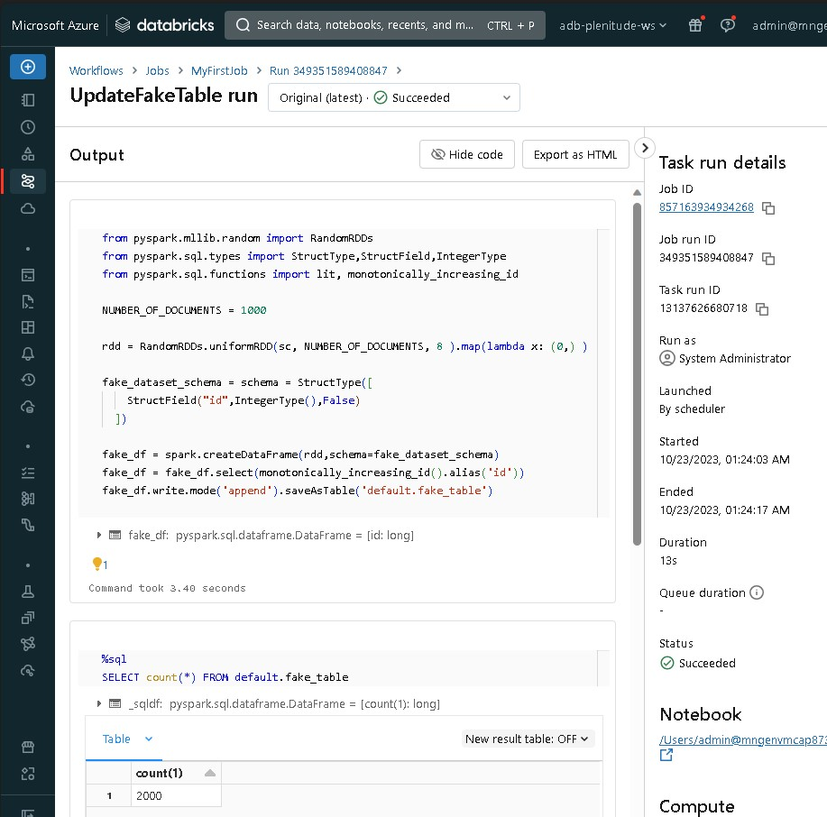

### Task 3: Delete the Job

1 - On the left-sided menu click on **Workflows** and then **Jobs** click on the delete icon at then end of the job entry row

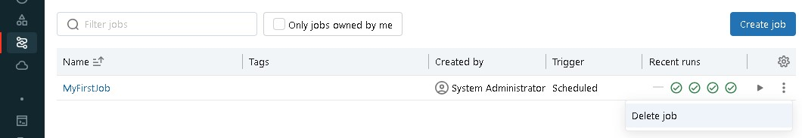

This Lab has been completed!