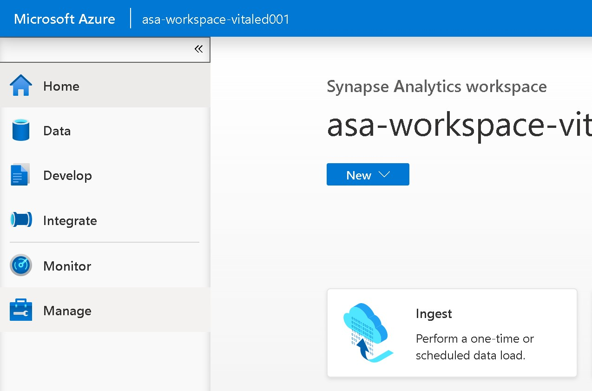
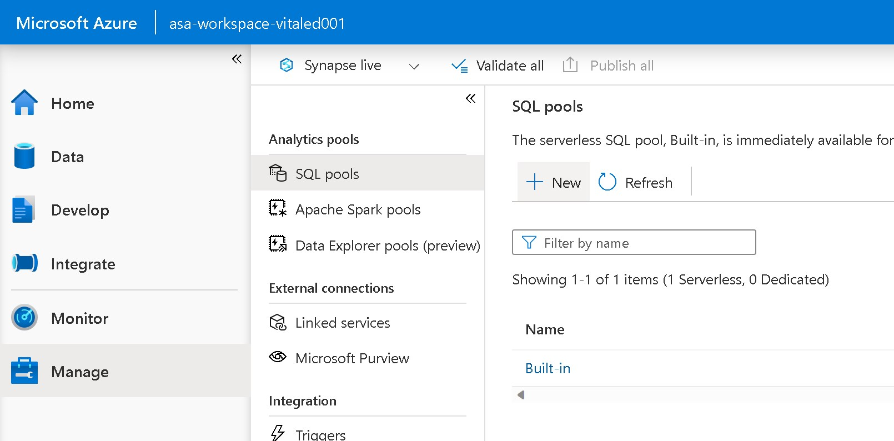
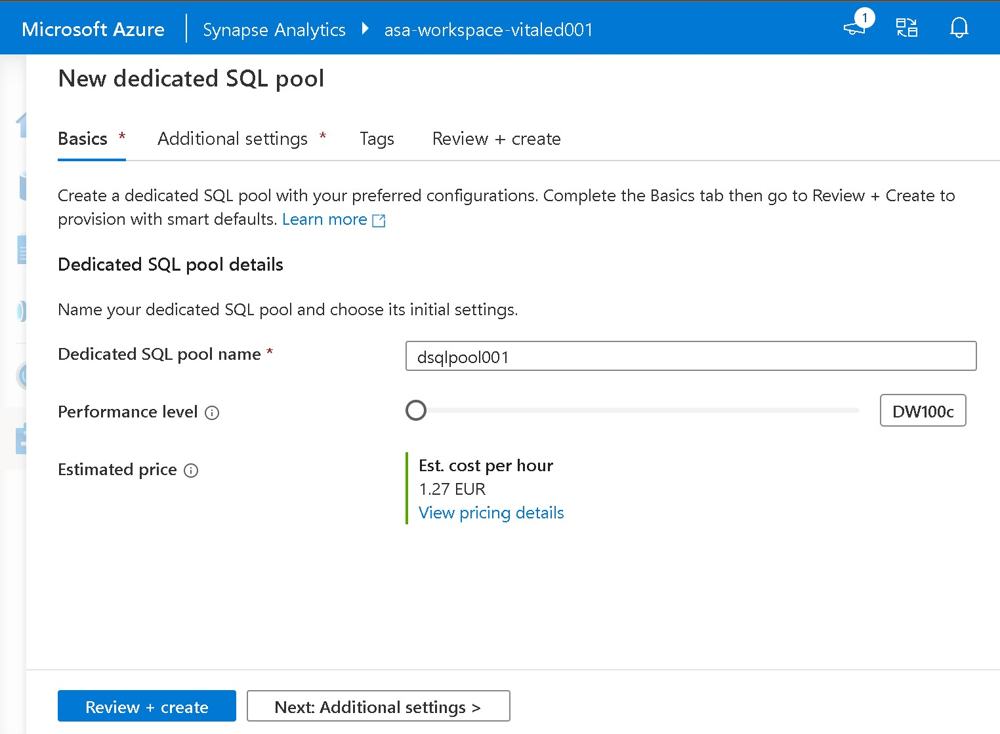
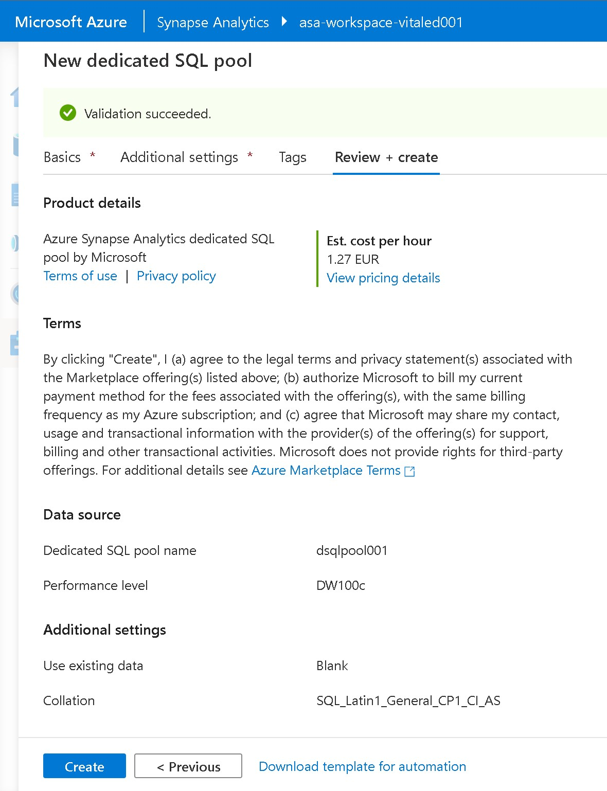
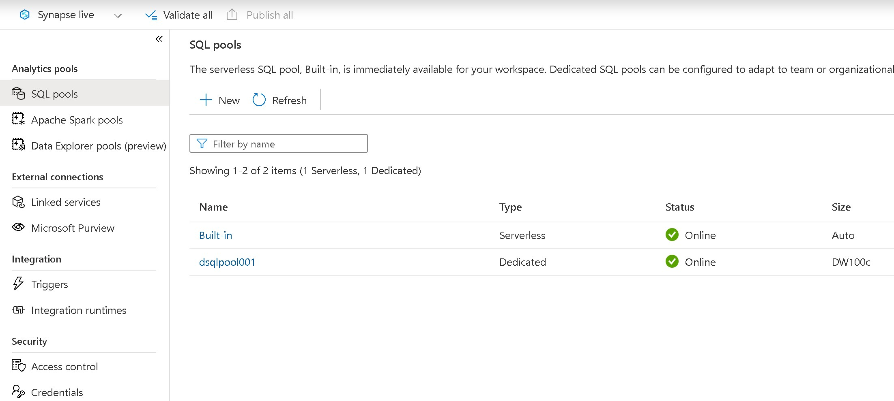

# Lab 11: Creating a Dedicated SQL Pool

## Goal 
During this lab you will learn how to create a dedicated sql pool in Synapse through the *Synaose Studio UI*

## Tasks

### Task 1: Creating the Databricks Workspace

Log in to the Azure Portal: [https://portal.azure.com](https://portal.azure.com)

In the Azure Synapse Studio UI click on **Manage** in the left-sided menu

In the *Manage* section click on *SQL Pools* and then on **+ New** 

Search for *Azure Synapse Analytics* in the search form and press enter

In the creation wizard provide the following details 

| Property       | Description                                                                                                                                     | Example                             |
| -------------- | ----------------------------------------------------------------------------------------------------------------------------------------------- | ----------------------------------- |
| Dedicated SQL pool name | Provide a name for your Dedicated SQL Pool. You can use any name you want | dsqlpool001              |
| Performance level         | Select a performance level for your dedicated sql pool                                                                          | DW100c                         |

then click on **Review + Create**

In the next page: 

click on **Create**

This will start the creation of your *dedicated sql pool*. The deployment can take few minutes. When the deployment process finish you will see a green sign in the Status column for the newly created SQL pool

This Lab has been completed!