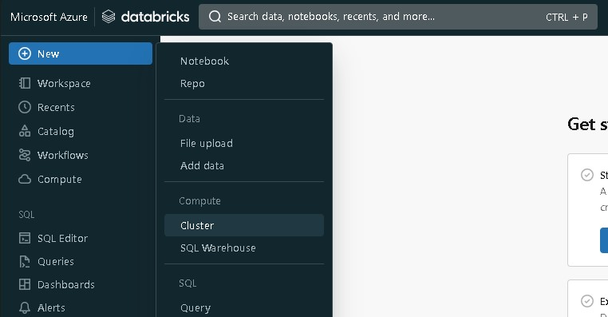
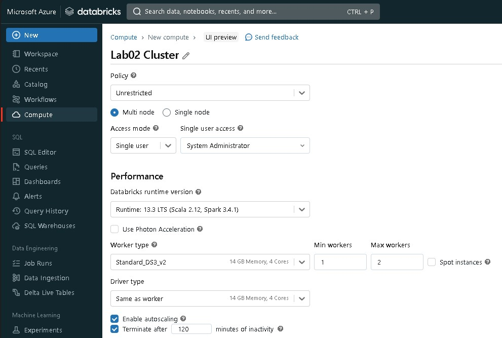
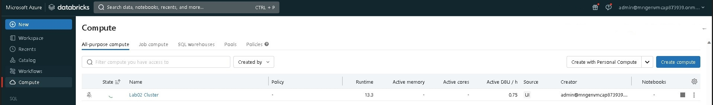
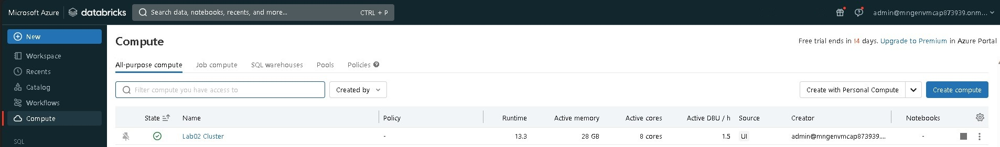

# Lab 02: Creating a Spark Cluster in Databricks

## Goal

During this lab you will learn how to create a spark cluster through the Azure Databricks UI

## Tasks

### Task 1: Create a cluster

1 - Into the Azure Databrick portal from the lef-sided menu select  **Create** + **Cluster**

2 - Provide the values to create a Databricks workspace

Provide the following values:

| Property                                                 | Description                                                                            | Suggested Value  |
|----------------------------------------------------------|----------------------------------------------------------------------------------------|------------------|
| Cluster name                                             | Name associated to the cluster                                                         | *Lab02 Cluster*  |
| Cluster mode                                             | Single mode or Multiple mode                                                           | Multiple         |
| Databricks runtime version                               | Version of the Databricks runtime, please select the most recent LTS Version available | Runtime 13.3 LTS |
| Photon Acceleration                                      | Enable or not enable the Photon Acceleration                                           | Disable  q       |
| Worker Type                                              | Type of node to use for Worker                                                         | Default Value    |
| Driver Type                                              | Type of node to use for Driver                                                         | Same as Worker   |
| Min Worker                                               | Minimum number of worker when autoscaling enabled                                      | 1                |
| Max Worker                                               | Maximum number of worker when autoscaling enabled                                      | 2                |
| Enable autoscaling                                       | Enable or not enable the autoscaling feature                                           | Yes              |
| Terminate after                                          | Number of minutes in idle state before automatically terminating the cluster           | 60               |

Click on **Create a Cluster**

The cluster creation will start and will take few minutes. To check the status of the creation, on the left-sided menu click on *Compute*
You should see a list of available cluster with a rotating spin on the one you just created

When the creation is terminated you will see a green flag on the side  

Congratulations, you created your first cluster!

This Lab has been completed!
