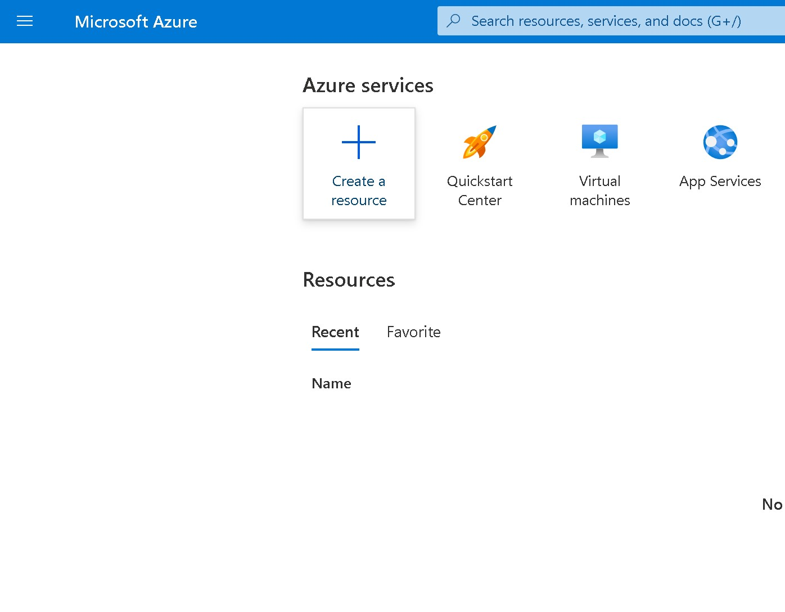
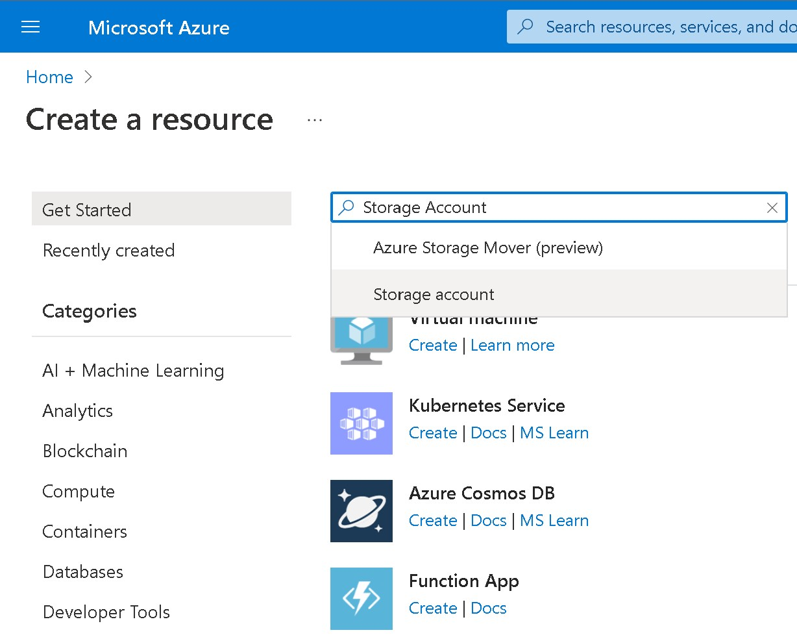
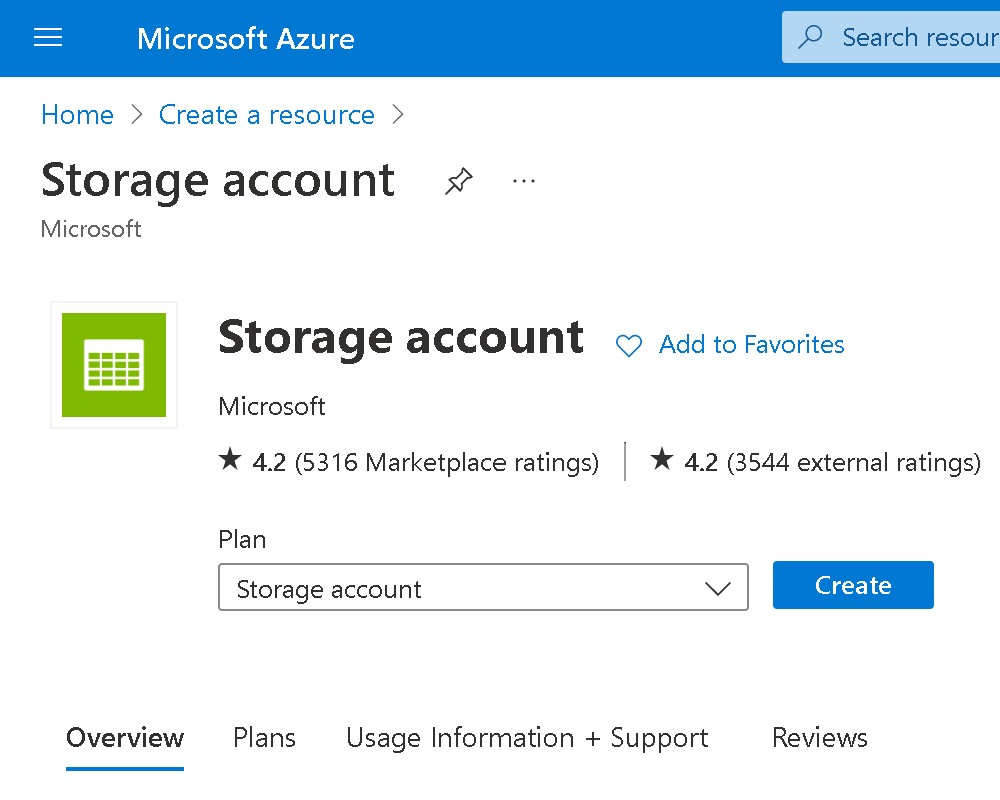
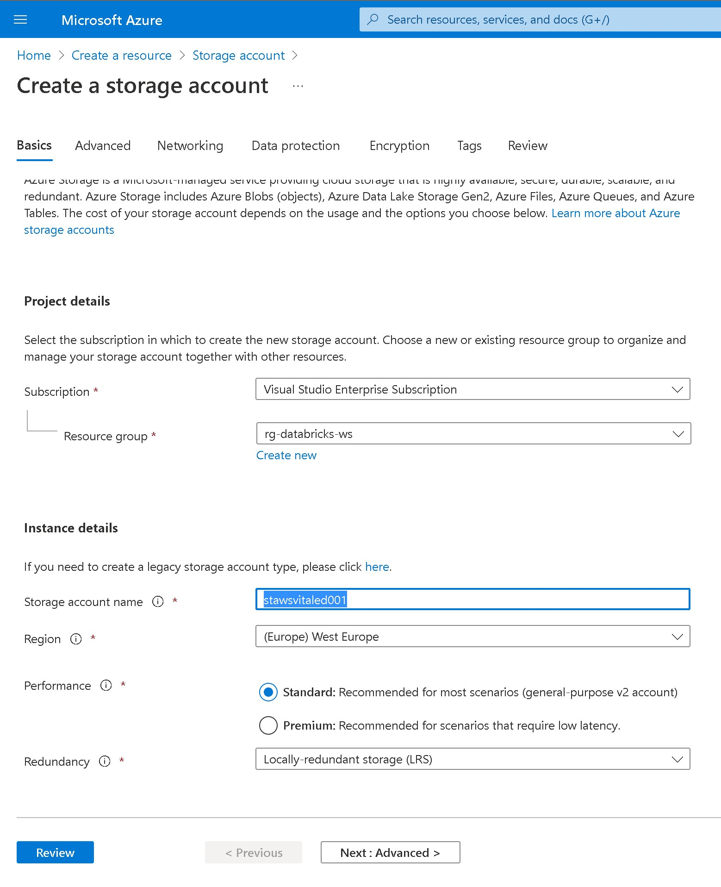
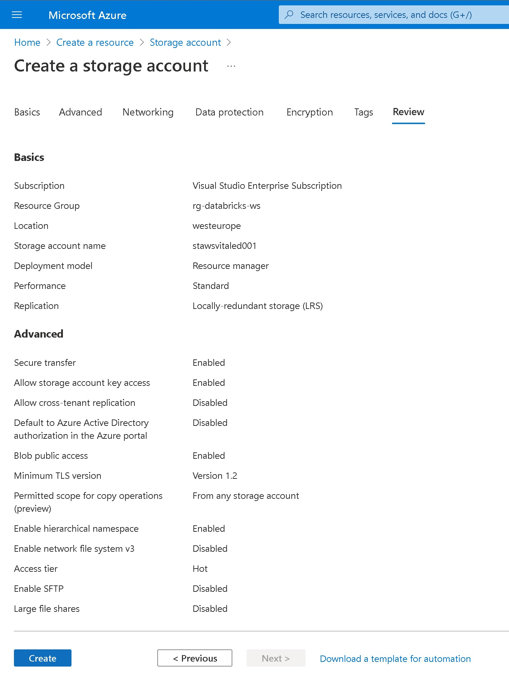

# Lab 08: Creating an Azure Storage Account

## Goal

During this lab you will learn how to create an **Azure Storage Account** through the Azure Portal

## Tasks

### Task 1: Creating the Storage Account

1 - Log in to the Azure Portal: [https://portal.azure.com](https://portal.azure.com)

2 - When in the portal click on **Create a resouce**

3 - Search for )Storage Account* in the search form and press enter

4 - In the Storage Account resouce page description click on *Create*

A wizard for the creation of the Storage Account should show up

5 - Provide the following values:

| Property       | Description                                                                                                                                     | Example                             |
| -------------- | ----------------------------------------------------------------------------------------------------------------------------------------------- | ----------------------------------- |
| Subscription   | From the drop-down, select your Azure subscription.                                                                                             | Azure Sponsorship Pass              |
| Resource Group | Create a new resource group or use the one created during the first lab. You can use any name you want. A resource group is a container that holds related resources for an Azure solution. | rg-workshop                         |
| Storage Account name | Provide a name for your Storage Account workspace. You can use any name you want but it should globally unique                                                                   | staworkshopadb001                       |
| Region         | Select your preferred region                                                                                                                    | West Europe                         |

6 - Click on *Next: Advanced*

In the next page flag the option **Enable Hierarchical namespace**

7 - Click on *Review*

8 - In the next page click on *Create*

This will start the creation of your storage account. The deployment can take few minutes. When the deployment process finish click on **Go to resource**

This Lab has been completed!
