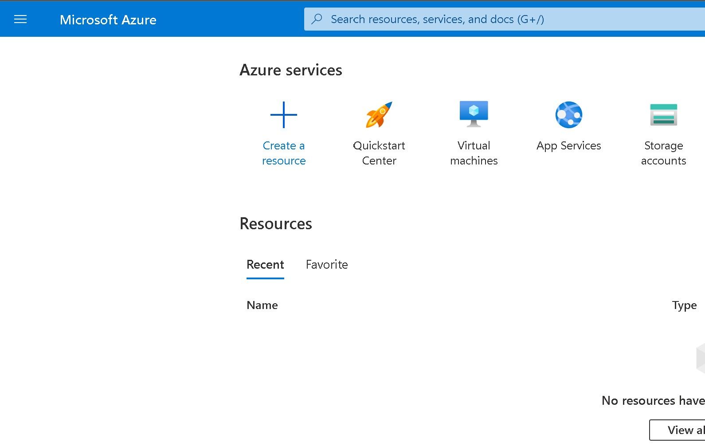
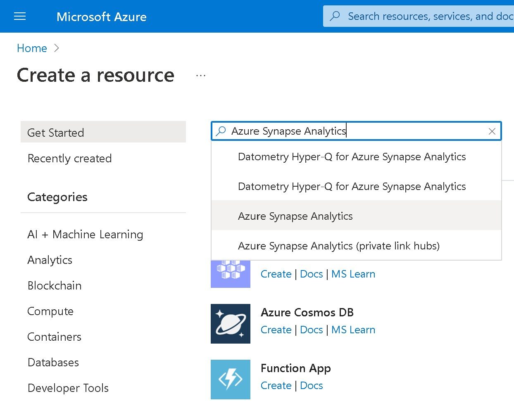
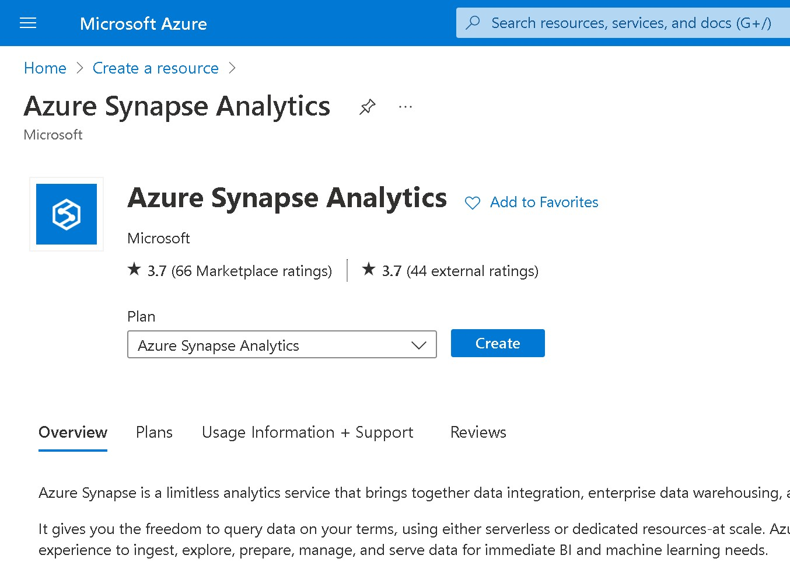
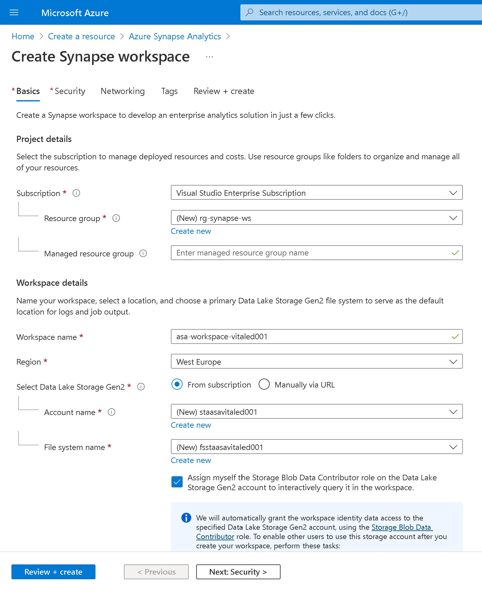
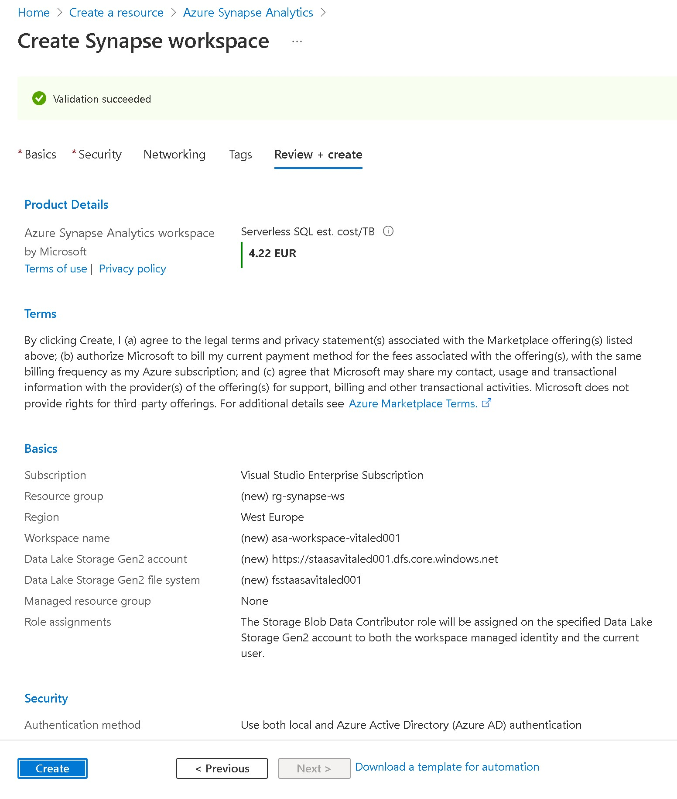
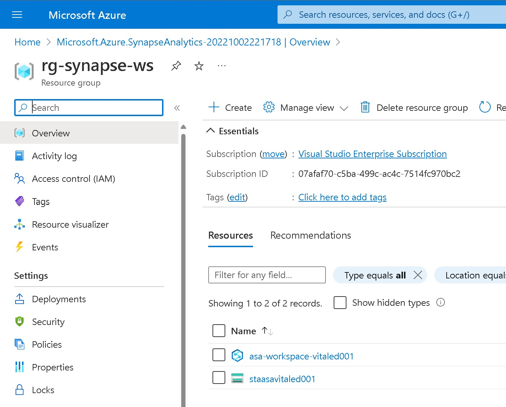
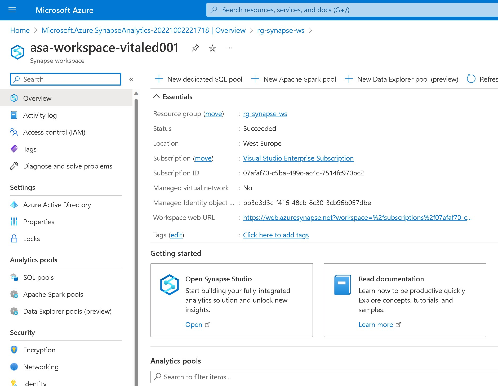
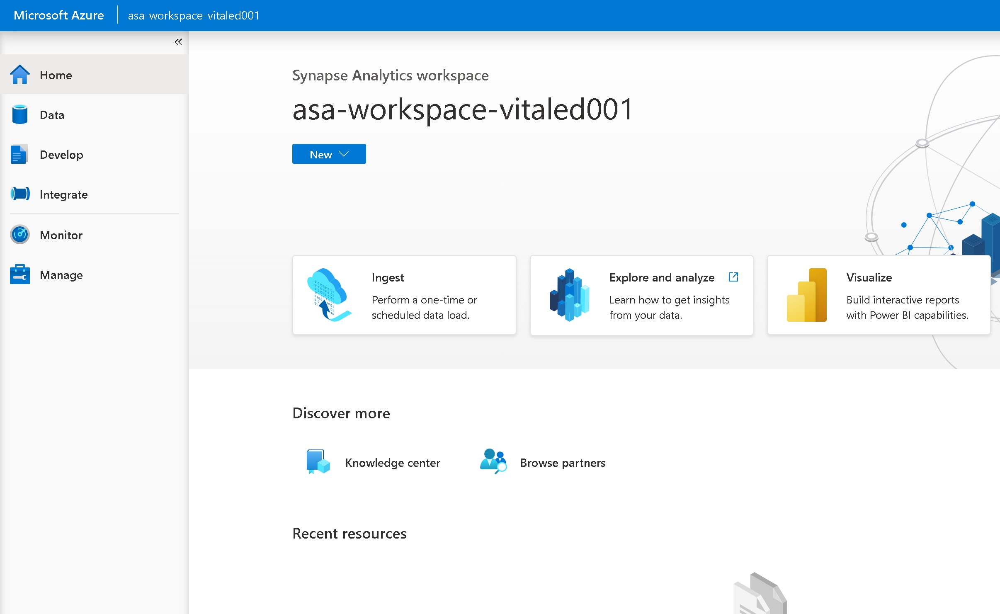

# Lab 10: Creating and configuring an Azure Synapse Workspace

## Goal 
During this lab you will learn how to create an **Azure Synapse workspace** through the Azure Portal

## Tasks

### Task 1: Creating the Synapse Workspace

Log in to the Azure Portal: [https://portal.azure.com](https://portal.azure.com)

When in the portal click on **Create a resource**

Search for *Azure Synapse Analytics* in the search form and press enter

In the Azure Synapse Analytics resouce page description click on *Create*

In the creation wizard provide the values to create an Azure Synapse Worspace

Provide the following values:

| Property       | Description                                                                                                                                     | Example                             |
| -------------- | ----------------------------------------------------------------------------------------------------------------------------------------------- | ----------------------------------- |
| Subscription   | From the drop-down, select your Azure subscription.                                                                                             | Azure Sponsorship Pass              |
| Resource Group | Create a new resource group. You can use any name you want. A resource group is a container that holds related resources for an Azure solution. | rg-synapse-ws                         |
| Workspace name | Provide a name for your Databricks workspace. You can use any name you want                                                                     | asa-workspace-vitaled001                       |
| Region         | Select your preferred region                                                                                                                    | West Europe                         |
| Account name| Click on *create new* and provide a name for a new Storage Account. You can use any name you want but it should be **globally unique** | staasavitaled001 |
File system name | Click on *create new* and provide a name for a new file system in the storage account. You can use any name you want |fsstaasavitaled001|

Click on **Review + Create**

In the next page: 

Click on **Create**

This will start the creation of your workspace. The deployment can take few minutes. When the deployment process finish click on **Go to resource**

### Task 2: Launch the Azure Synapse Workspace

After clicking on **Go to resource** you will be brought to the resource group page. 

Click on the Azure Synapse Workspace resource (in this example *asa-workspace-vitaled001*)

When in the Azure Synapse Analytics Workspace resource page click on **Open Synapse Studio**

You’ll be signed in to the Synapse Studio automatically.

Congratulations you're in your Synapse workspace

This Lab has been completed!