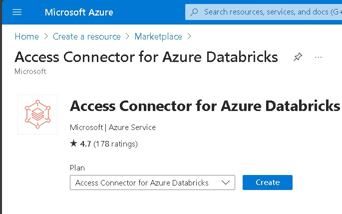
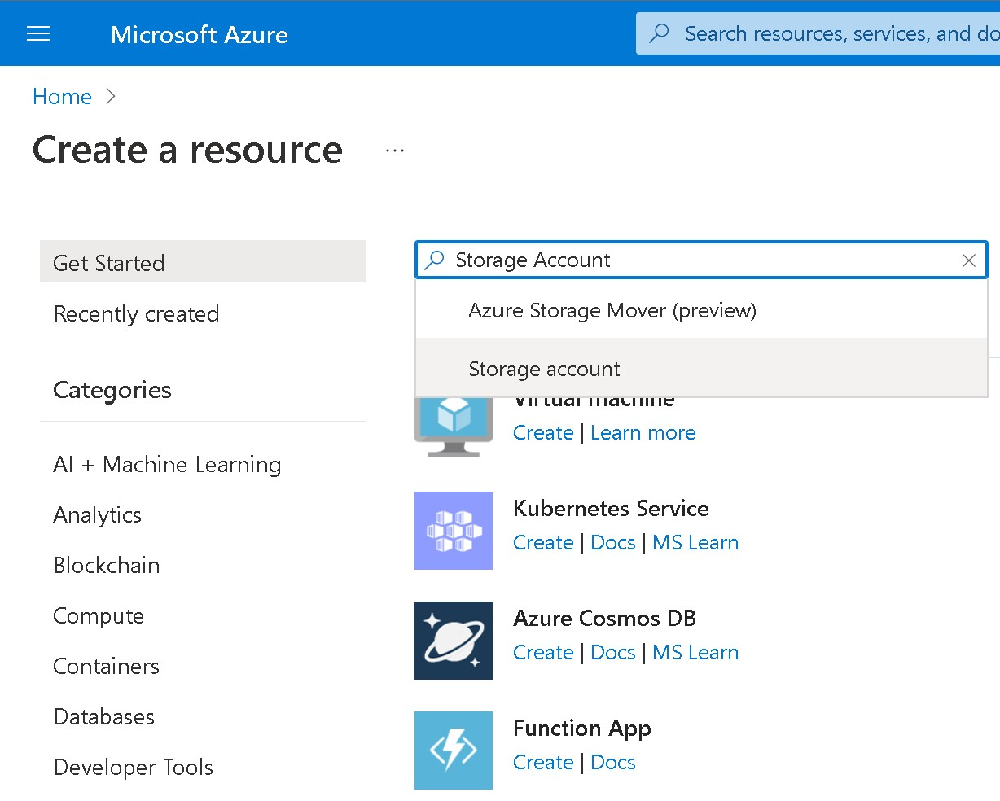
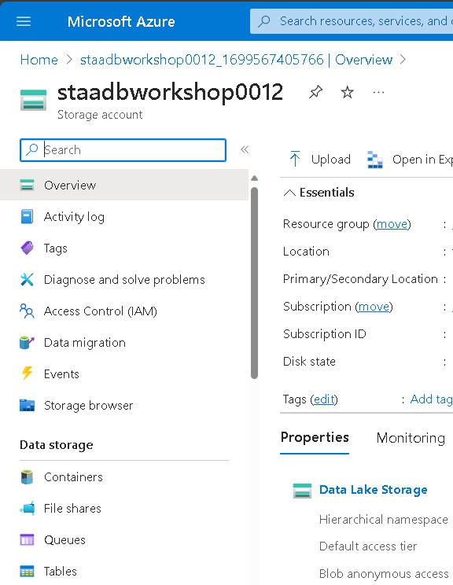

# Lab 08: Enable the Unity Catalog

## Goal

During this lab you will learn how to create a **Unity Catalog metastore** and assign a workspace to it

## Tasks

### Task 1: Create an Access Connector for Azure Databricks

1 - Log in to the Azure Portal: [https://portal.azure.com](https://portal.azure.com)

2 - When in the portal click on **Create a resouce**

3 - Search for *Access Connector for Azure Databricks* in the search form and press enter

4 - In the *Access Connector for Azure Databricks* resource page description click on *Create*

A wizard for the creation of the Access Connector should show up

5 - Provide the following values:

| Property       | Description                                                                                                                                     | Example                             |
| -------------- | ----------------------------------------------------------------------------------------------------------------------------------------------- | ----------------------------------- |
| Subscription   | From the drop-down, select your Azure subscription.                                                                                             | Azure Sponsorship Pass              |
| Resource Group | Create a new resource group or use the one created during the first lab. You can use any name you want. A resource group is a container that holds related resources for an Azure solution. | rg-workshop                         |
| Name | Provide a name for your Connector                                      | acadmetastore                       |
| Region         | Select the same region you used for the Databricks Workspace creation                                                                                                                | West Europe

6 - Click on *Review + Create*

7 - In the next page click on *Create*

This will start the creation of your storage account. The deployment can take few minutes. When the deployment process finish click on **Go to resource**

8 - In the Access Connector page click on *Properties* from the left-sided menu 

9 - Copy the value of the *ID* property

10 - Keep the value in a notepad to be used in the last task

### Task 2: Create a Storage Account

1 - Log in to the Azure Portal: [https://portal.azure.com](https://portal.azure.com)

2 - When in the portal click on **Create a resouce**

3 - Search for *Storage Account* in the search form and press enter

4 - In the Storage Account resource page description click on *Create*

A wizard for the creation of the Storage Account should show up

5 - Provide the following values:

| Property       | Description                                                                                                                                     | Example                             |
| -------------- | ----------------------------------------------------------------------------------------------------------------------------------------------- | ----------------------------------- |
| Subscription   | From the drop-down, select your Azure subscription.                                                                                             | Azure Sponsorship Pass              |
| Resource Group | Create a new resource group or use the one created during the first lab. You can use any name you want. A resource group is a container that holds related resources for an Azure solution. | rg-workshop                         |
| Storage Account name | Provide a name for your Storage Account workspace. You can use any name you want but it should globally unique                                                                   | staworkshopadb001                       |
| Region         | Select your preferred region                                                                                                                    | West Europe                         |

6 - Click on *Next: Advanced*

In the next page flag the option **Enable Hierarchical namespace**

7 - Click on *Review*

8 - In the next page click on *Create*

This will start the creation of your storage account. The deployment can take few minutes. When the deployment process finish click on **Go to resource**

### Task 3: Create containers in the storage account

1 - In the Storage Account page click on *Containers* from the left-sided menu

2 - Click on *+ Container*

3 - Put *metastore* as name
                    |

4 - Click on *Create*

5 - Repeat the same steps to create a container named *raw*

6 - Repeat the same steps to create a container named *export*

### Task 4: Give to the Access Connector the permission to access the storage account

1 - In the Storage Account page click on *Access Control (IAM)* from the left-sided menu

2 - Click on *+ Add*

3 - click on *Add role assignment*

4 - In the add role assignment search for *Storage Blob Data Contributor* and click on it

Then click on *next*

5 - In the following page select *Managed Identity and *click on * + Select members*

6 - In the *Select Managed Identities* page select *Access Connector for Azure Databricks* and click on the Access Connector for Azure Databricks name you created in *Task 1* and click on close

Then click on *review + assign* and then *assign*.

### Task 5: Create a Unity Catalog metastore and assign a workspace to it

1 - Connect to the databricks workspace

2 - From the top-right menu click on your username and then on  *Manage Account*

3 - In the Databricks Account Page Click on *Data*

4 - Click on *Create Mestasore*

5 - In the *Create Metastore* page provide the following values:

| Property       | Description                                                                                                                                     | Example                             |
| -------------- | ----------------------------------------------------------------------------------------------------------------------------------------------- | ----------------------------------- |
|Name   | Provide a name for your metastore | wsmetastore |
| Region | Select your metastore region | westeurope |
| ADLS Gen 2 path | Select the storage account and the container "metastore" you created in the previous taks | metastore@staworkshopadb001.dfs.core.windows.net | 
| Access Connector Id | Insert the Connector Id you copied in the *Task 1* |                          |

Then click on *create*

6 - In the *next page* page select the workspace you created in the Lab01 and click on *Assign*

The lab is completed!