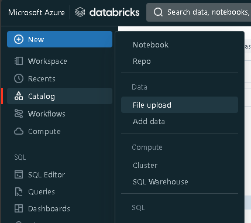
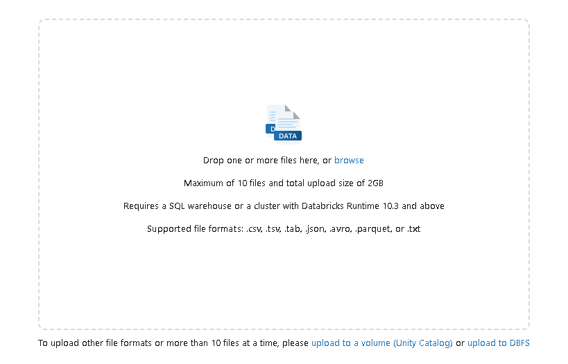
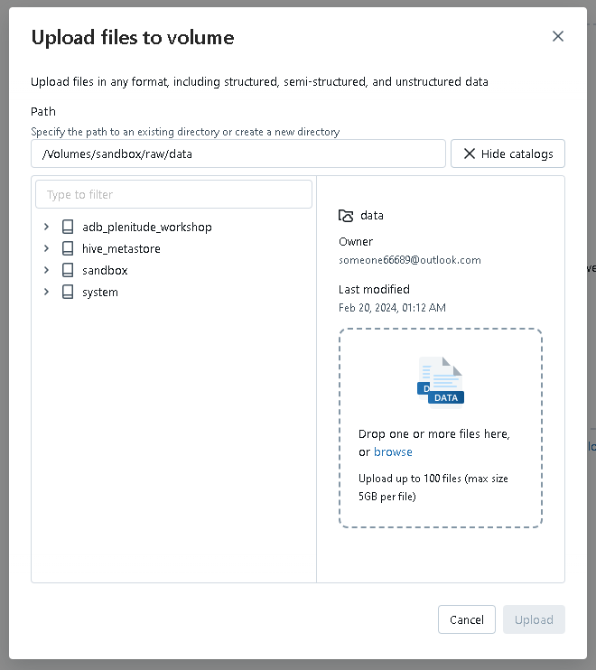
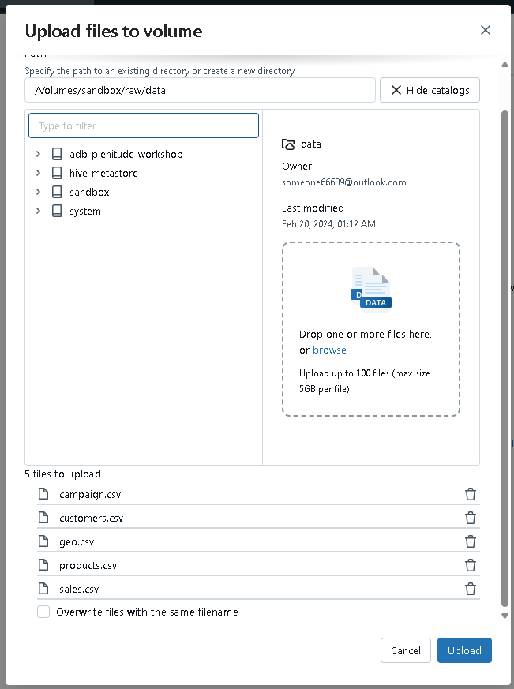

# Lab 08: Create a volume and upload data

## Goal

During this lab you will learn how to create a volume in Databricks and how to upload data in it

## Tasks

### Task 1: Create a volume in Databricks

Import the .dbc file [Lab08.dbc](Lab08.dbc)  into your workspace and follow the instructions inside the notebook.

### Task 2: Upload data in the volume

1. Download the files in [data/sales](../../../data/sales) to your laptop in a known location

1. Into the Azure Databrick portal from the lef-sided menu select  **+ New** + **File Upload**

1. - Click on upload to a volume (Unity Catalog)

1. - Select *sandbox* -> *raw* -> *data* and click on *browse*

1. - Select the file download in the first step and click on *upload*

The lab is completed!
